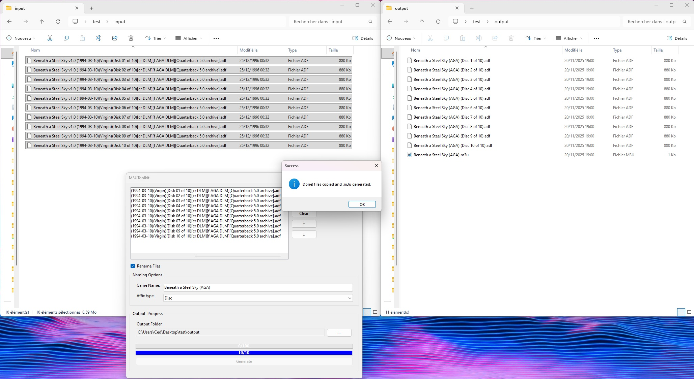

# M3UToolkit – 100 % safe multi-disc .m3u creator

Never touches your original files – works only on copies.

**Free & open-source under GPL-3.0**  
Want to integrate M3UToolkit in a **commercial / paid** frontend, emulator or distribution without GPL obligations?  
→ **Commercial license available** (one-time fee).  
Contact: ced30.dev@proton.me

# English

**M3UToolkit** is a WinForms application to generate `.m3u` playlists and rename files automatically.

## Features

- Generate `.m3u` playlists from a folder of files.
- Automatically rename files (name + number, character removal, etc.).
- Track progress with a progress bar displaying text.
- Export and save playlists easily.

## Installation

1. Clone the repository:
   ```bash
   git clone https://github.com/Ced30/M3UToolkit.git
   
2. Open M3UToolkit.sln in Visual Studio.

3. Build and run the project (Debug or Release).

Notes

This is the first stable version providing the core functionality. Intended for personal use or to test the main features.

License

This project is licensed under the GNU General Public License v3 (GPLv3). You are free to use, modify, and distribute this software under the terms of the GPLv3.
See the LICENSE
 file for details.

---

# Français

**M3UToolkit** est une application WinForms qui permet de générer automatiquement des playlists `.m3u` et de renommer vos fichiers multimédias.

## Fonctionnalités

- Génération de playlists `.m3u` à partir d’un dossier de fichiers
- Renommage automatique des fichiers (nom + numérotation, suppression de caractères indésirables, etc.)
- Suivi de l’avancement avec une barre de progression et affichage du texte en cours
- Export et sauvegarde facile des playlists

## Installation

1. Cloner le dépôt :
   ```bash
   git clone https://github.com/Ced30/M3UToolkit.git   

2. Ouvrir le fichier M3UToolkit.sln dans Visual Studio

3. Compiler et exécuter le projet (mode Debug ou Release)

Notes
Il s’agit de la première version stable qui propose les fonctionnalités principales.
L’application est destinée à un usage personnel ou pour tester les fonctions de base.
Licence
Ce projet est sous licence GNU General Public License v3 (GPLv3).
Vous êtes libre d’utiliser, modifier et distribuer ce logiciel selon les termes de la GPLv3.
Voir le fichier LICENSE pour plus de détails.

# In Use:




Développé par @Ced30

